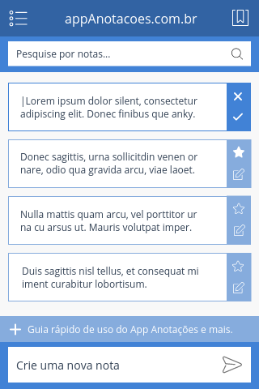

# App Anotações

> Um Web App de anotações em VueJS

Acesse este projeto em seu navegador: [AppAnotacoes.com.br](http://appanotacoes.com.br/) *(em desenvolvimento)*

## Design
Está é a projeção de como o App vai ficar depois de pronto:



## Tarefas (17/21)
* (x) Criação do projeto
* (x) Criação do design do App
* (x) Definição das tarefas
* (x) Implementação Webpack
* (x) Componente de topo
* (x) Componente de busca
* (x) Componente anotação
* (x) Comportamento de edição no componente de anotação
* (x) Componente de aviso
* (x) Componente de nova anotação
* (x) Função para listar as anotações
* (x) Função de salvar uma anotação
* (&nbsp;&nbsp;) Função de marcar uma anotação como favorita
* (x) Função de excluir uma anotação
* (x) Implementar suporte a páginas - VueRouter
* (&nbsp;&nbsp;) Componente de Página
* (x) Componente de Menu
* (&nbsp;&nbsp;) Função pesquisar por anotações
* (&nbsp;&nbsp;) Listagem de anotações favoritadas
* (x) Componente de modal de aviso inicial
* (x) Balão de aviso

## Build Setup

``` bash
# install dependencies
yarn install

# serve with hot reload at localhost:8080
yarn run dev

# build for production with minification
yarn run build

# run unit tests
yarn run unit

# run e2e tests
yarn run e2e

# run all tests
yarn test
```

For detailed explanation on how things work, checkout the [guide](http://vuejs-templates.github.io/webpack/) and [docs for vue-loader](http://vuejs.github.io/vue-loader).
